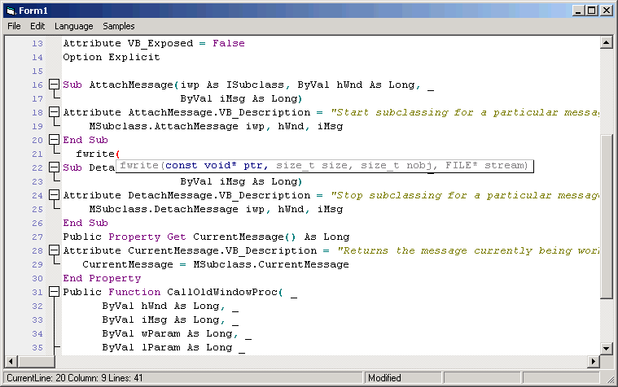



## clsScintilla: Scintall Source Code Highlighting DLL in VB

### Description

Update: ClearUndoBuffer called when opening a document and also when creating a new document. This will prevent performing an undo event or redo event after creating a new document. Also added undo and redo (CTRL+Z and CTRL+Y) to the removehotkeys function so it won't double undo or double redo. Also noticed in replaceall I had left a debug.print which was the biggest reason for it's incredibly slow speed. Removed that.

This is a wrapper for Scintilla. For those of you who don't know it's a source code highlighting component wrapped in a DLL. It is written in C++ and regularly updated.

The main portion of this code is a class file which provides control like properties and functions. It also has a Find, Replace and Goto form, and several modules. Thanks to Steve McMahon from VbAccelerator who helped me on several things when writing this. Also thanks to the author of ScintillaVB which I did get some pieces of code from and plenty of ideas. And most of all thanks to the authors of Scintilla. This code is not yet complete and honestly probably never will be due to how often scintilla is updated, but it's got a good ammount of support for Scintilla built in. I will post updates in features and bug fixes as they are done. Please if you find a bug or wish to see something of scintilla added which is not already available post it on the forums at http://www.ceditmx.com. Please leave comments an d suggestions :)
 
### More Info
 

             |
---                |---
**Submitted On**   |2005-09-02 15:56:52
**By**             |[Stewart](https://github.com/Planet-Source-Code/PSCIndex/blob/master/ByAuthor/stewart.md)
**Level**          |Intermediate
**User Rating**    |4.2 (21 globes from 5 users)
**Compatibility**  |VB 6\.0
**Category**       |[Custom Controls/ Forms/  Menus](https://github.com/Planet-Source-Code/PSCIndex/blob/master/ByCategory/custom-controls-forms-menus__1-4.md)
**World**          |[Visual Basic](https://github.com/Planet-Source-Code/PSCIndex/blob/master/ByWorld/visual-basic.md)
**Archive File**   |[clsScintil192928922005\.zip](https://github.com/Planet-Source-Code/stewart-clsscintilla-scintall-source-code-highlighting-dll-in-vb__1-62404/archive/master.zip)

